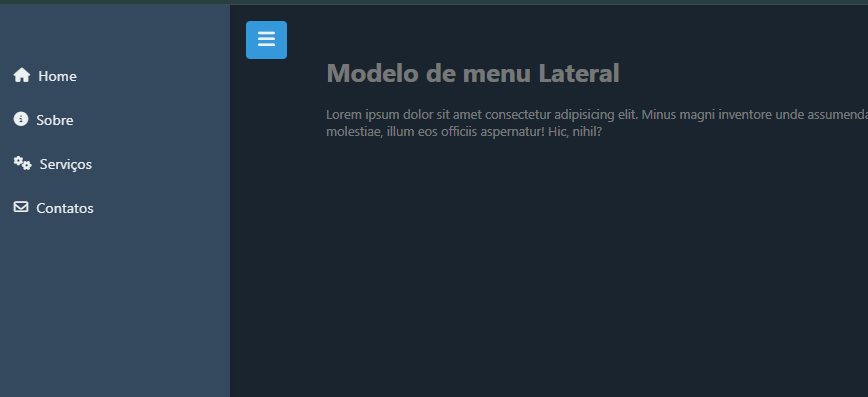

<p align="center">
    
</p>
<p align="center">Preview <b>Menu Lateral</b></p>

# 🍔 Menu Lateral Responsivo

Este projeto é um exemplo de implementação de um menu lateral, desenvolvido com **`HTML`**, **`CSS`** e **`JavaScript`**, com uso de ícones da **FontAwesome**. O menu apresenta uma animação de transição suave e interage com o conteúdo da página e o plano de fundo.

## 🎯 Para que serve ?

Este projeto demonstra um menu lateral responsivo com transições suaves. Ele é útil para sites que precisam de navegação lateral que pode ser escondida e exibida com facilidade, melhorando a experiência do usuário em dispositivos móveis e desktops.

## 👀 Demonstração

Para visulizar o projeto [Ciique aqui](https://luizvictorino.github.io/menu-lateral/).

## 💡 Funcionalidades

* 📑 Menu Lateral Dinâmico: Menu que desliza para dentro e fora da tela com animações suaves.
* 🎨 Ícones Interativos: Usando FontAwesome para melhorar a interface.
* 📱 Responsividade: Totalmente adaptado para diferentes tamanhos de tela.
* 🌑 Fundo Escurecido: Quando o menu é aberto, o fundo semitransparente foca a atenção no menu.

## 🛠️ Tecnologias Utilizadas

* ⚙️ HTML5: Estruturação da página.
* 🎨 CSS3: Estilização e animações.
* 💻 JavaScript: Controle de interatividade.
* 🚀 FontAwesome: Biblioteca de ícones.
* 🤖 ChatGPT: Utilizado para auxiliar na escrita, comentários no código e refinamento da documentação.

## 📁 Estrutura de Pasta 

```
├── index.html      # Página principal do projeto
├── styles.css      # Estilos aplicados ao menu e ao conteúdo
├── scripts.js      # Lógica de interação com o menu
└── README.md       # Documentação do projeto

```

## 🚀 Como Usar

### 1. Clone o repositório:

Para começar, clone o repositório para a sua máquina local usando o comando abaixo:

```bash
git clone https://github.com/luizvictorino/menu-lateral.git
```

### 2. Acesse o diretório do projeto:

Navegue até o diretório onde o repositório foi clonado:

```bash
cd nome-do-repositorio
```


### 3. Abra o arquivo HTML:

Basta abrir o arquivo **`index.html`** diretamente no navegador de sua preferência. Não há necessidade de um servidor local para executar este projeto.

Você pode fazer isso clicando duas vezes no arquivo ou abrindo-o com o navegador a partir da linha de comando:

```bash
open index.html
```

Interaja com o menu:

Use o botão de menu lateral (ícone de "hambúrguer") para exibir ou ocultar o menu e observe como o conteúdo e o fundo da página reagem às interações.


## 👥 Desenvolvedor

Projeto desenvolvido por:
<p>
    
    <p>&nbsp&nbsp&nbsp <b>Luiz Victorino</b><br>&nbsp&nbsp&nbsp
    <a href="https://github.com/luizvictorino" target="_blank">GitHub</a>
    &nbsp;|&nbsp;
    <a href="https://www.linkedin.com/in/luiz-victorino/" target="_blank">Linkedin</a>
</p>
